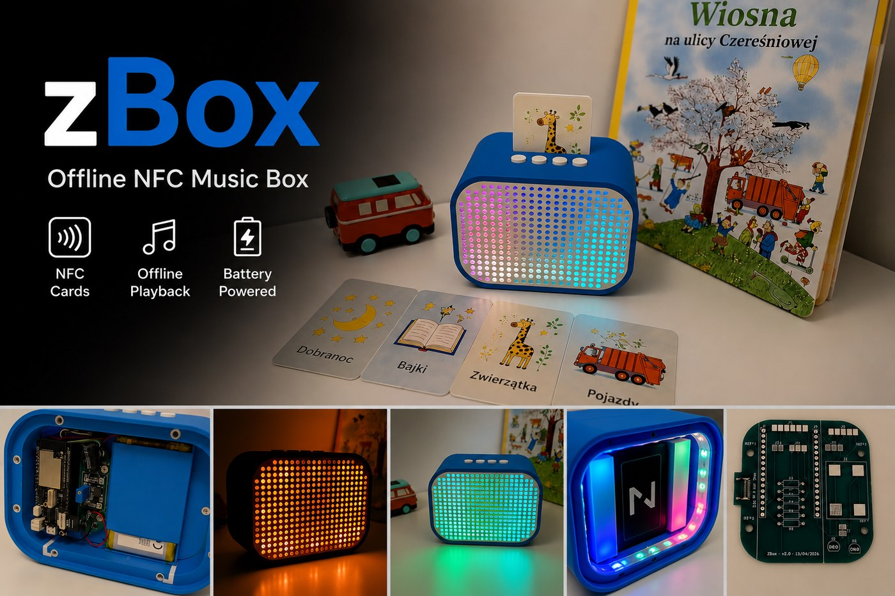
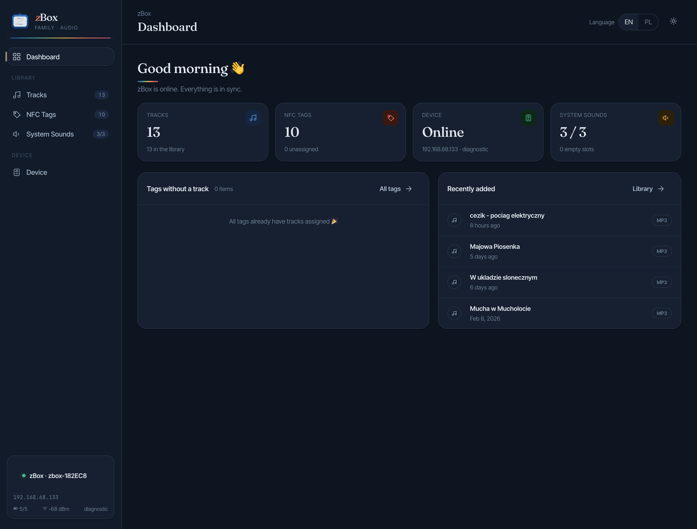
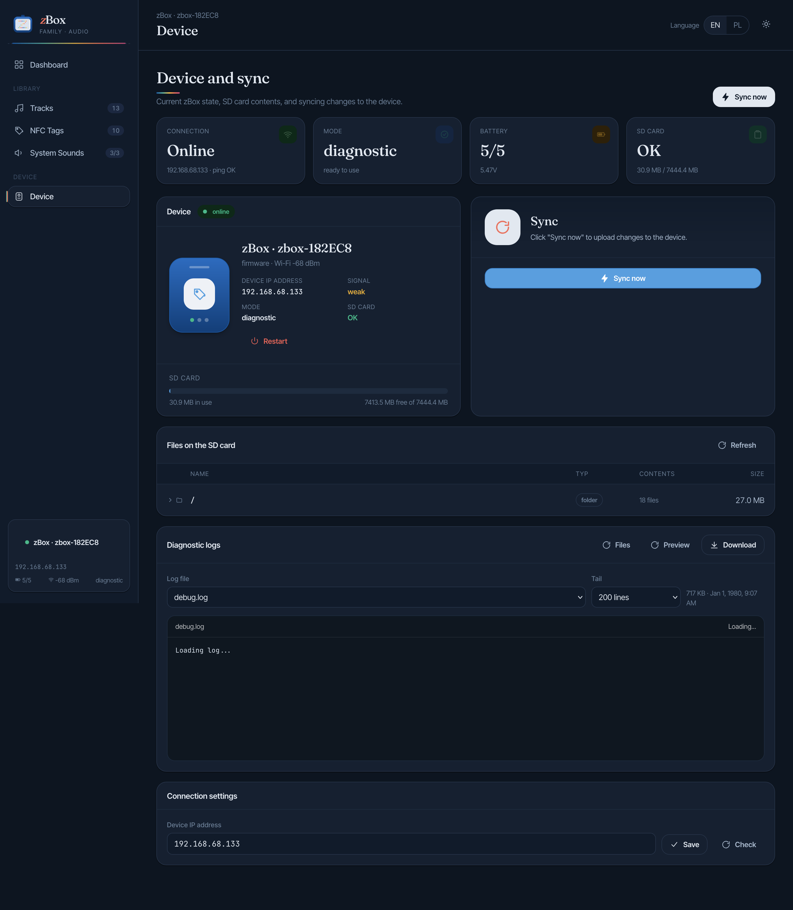

# zBox



zBox is a custom offline NFC audio box I built for my daughter. It combines an ESP32, local SD card playback, a Raspberry Pi-hosted admin portal, LED effects, and a 3D-printed enclosure into a durable player that works with NFC cards.

This repository is the full build source for the project: firmware, backend, web admin, PCB design files, and the project documentation needed to rebuild it or adapt it for a similar box. The device plays audio stored on its SD card after an NFC tag is presented, and Wi-Fi is only used for sync and maintenance.

The box itself is built around a 3D-printed shell and custom electronics. This repository focuses on the complete hardware and software stack used in the build, from the ESP32 firmware and server to the PCB sources and operating notes. Mechanical exports such as the Fusion 360 STEP model live in `hardware/cad/fusion360/step/`.

## Project gallery

<p>
  
  
</p>
<p>
  
  
  
</p>

## Repository layout

```text
.
├── docs/                   Project documentation
├── esp32/                  ESP32 firmware (PlatformIO)
├── server/                 FastAPI backend and web admin UI
├── web/                    Static admin portal
├── hardware/               PCB, KiCad, Gerbers, and CAD exports
├── assets/                 Project photos and media used in docs
├── scripts/                Utility scripts
├── Dockerfile
└── docker-compose.yml
```

## Project split

- `esp32/` contains the offline playback firmware, Bluetooth audio pipeline, NFC handling, LED logic, and sync mode.
- `server/` contains the FastAPI backend, SQLite integration, sync logic, and admin API.
- `web/` contains the static admin portal served by the backend.
- `hardware/pcb/kicad/` contains the PCB and schematic sources for the hardware build.
- `hardware/pcb/gerbers/` contains manufacturing outputs.
- `hardware/cad/fusion360/step/` contains exported mechanical CAD files such as STEP models.
- `assets/photos/` contains the product images used in this README.

## What to buy

If you want to build the current hardware revision, this is the practical shopping list. The various `PAD_*` items in KiCad are just solder pads for wires, not parts you need to buy.

- `1x` ESP32 Lolin D32 Pro
- `1x` PN532 NFC module that supports SPI mode
- `1x` MT3608 step-up module
- `1x` USB-C receptacle `GCT USB4085` or a compatible `USB 2.0 14-pin` footprint match
- `1x` P-channel MOSFET `AO3415A` in `SOT-23`
- `1x` NPN transistor `BC547` in `TO-92`
- `1x` electrolytic capacitor `470uF`
- `2x` resistors `5.1k`
- `1x` resistor `2.2k`
- `1x` resistor `10k`
- `1x` resistor `22k`
- `1x` resistor `100k`
- `1x` WS2812B LED strip or panel for the front light matrix
- `4x` momentary tactile buttons for `A`, `B`, `C`, and `D` — `12 × 12 × 7.3 mm`, 4-pin TACT switches with colored caps (e.g. MSALAMON kit or any equivalent 12 × 12 × 7.3 mm TACT switch)
- `1x` LiPo battery, currently `Akyga LP805080 3.7V / 4000mAh` with `JST 2-pin` connector
  This is the battery used in my build. Pack size: `8 mm` thick, `50 mm` wide, `80 mm` high. If you swap it for another pack, check the physical dimensions against the enclosure first.
- `1x` Bluetooth speaker, currently `JBL Go 2`
- hookup wire for all off-board connections

You will also need the non-electronic build parts:

- 3D-printed enclosure parts from the project CAD
- speaker holder inserts matching the audio setup you choose
- screws or other mounting hardware that fit your chosen assembly method

## Build cost

This is what I spent building one unit. Prices reflect individual-quantity purchases — buying components in bulk would bring the per-unit cost down.

| Part | Cost |
|------|------|
| PCB manufacturing | $5 |
| ESP32 Lolin D32 Pro | $15 |
| LiPo battery | $10 |
| Tactile buttons | $1 |
| Electronic components (resistors, caps, MOSFET, etc.) | ~$5–10 |
| 3D-printed enclosure filament | — |
| Bluetooth speaker (JBL Go 2) | had it at home |
| **Total (without speaker and filament)** | **~$36–41** |
| Enclosure design, prototype prints, and iteration | countless hours |
| Electrical prototyping and circuit debugging | countless hours |
| Fixing the low-quality software Claude Code produced | countless hours |

## Hardware overview

```text
NFC card
        │
        ▼
   PN532 reader
        │
        ▼
 ESP32 Lolin D32 Pro
   ├── SD card with local audio
   ├── WS2812B LED panel
   ├── buttons A / B / C / D
   ├── speaker power control
   └── Wi-Fi for sync and maintenance
        │
        ▼
 Bluetooth speaker
```

The device is offline-first during normal use. Audio and mappings live on the SD card, while Wi-Fi is only used for sync and maintenance.

## Audio design notes

For the current build I used a `JBL Go 2` connected over Bluetooth. It was a pragmatic choice: I already had that speaker at home, it was collecting dust, and I wanted the sound quality to stay reasonably good instead of dropping in a very cheap `2 USD` speaker.

I originally tried a direct wired path using a `PCM5102A` audio module and a jack connection into that speaker, but I could not get rid of the noise and crackling well enough to be happy with the result. Bluetooth ended up being the cleaner and more reliable solution for this revision.

The long-term plan is to reuse the speaker drivers from the JBL and connect them directly to the ESP32 through an `I2S Audio Amplifier Module NS4168`. The reason for that direction is simple: it should remove the extra Bluetooth speaker from the mechanical stack, give tighter integration with the enclosure, and keep a proper digital audio path from the ESP32 to the amplifier.

The enclosure is designed so the current speaker is slid into dedicated internal holders. Those holders are easy to change, so they can later be replaced with inserts for a simpler ESP32-connected speaker setup or for another self-contained speaker body in a `JBL`-style form factor.

## PCB and schematic

If you want to inspect or modify the hardware design, start here:

- Schematic: [zbox.kicad_sch](hardware/pcb/kicad/zbox.kicad_sch)
- PCB layout: [zbox.kicad_pcb](hardware/pcb/kicad/zbox.kicad_pcb)
- KiCad project: [zbox.kicad_pro](hardware/pcb/kicad/zbox.kicad_pro)
- Manufacturing outputs: [hardware/pcb/gerbers](hardware/pcb/gerbers)
- 3D enclosure export: [zbox_clear.step](hardware/cad/fusion360/step/zbox_clear.step)

## Printing the enclosure

The STEP model is ready to print. Each part must be printed separately. Print orientation matters:

| Part | Orientation |
|------|-------------|
| Shell (main body) | Standing upright on the front face |
| Side wall | Vertical |
| Front cover | No strong preference |
| Rear cover | Lying flat on its inner surface |

A few practical notes from the actual build:

- The buttons are soldered onto a protoboard — there is no custom PCB for them. The build uses **12 × 12 × 7.3 mm momentary tactile switches (TACT, 4-pin)** with colored caps, from the MSALAMON kit. Any equivalent 12 × 12 × 7.3 mm TACT switch will fit.
- The cutout for the button board in the enclosure is not symmetric. This can be corrected in Fusion 360, or you can just account for it when positioning the buttons during soldering. It turned out that way, reason unknown.
- The button board is attached to the speaker enclosure with hot glue.

## Hardware disclaimer

I am self-taught when it comes to electronics, so the hardware part of this project may still contain mistakes, weak assumptions, or design issues that I am not aware of.

The current revision works for me in real use, but if you want to reuse, manufacture, or adapt it, treat the design as something to review carefully rather than as a guaranteed reference design. In classic programmer terms: it works on my desk.

## First build walkthrough

Complete flow from assembled hardware to first playback.

**1. Prepare the SD card**

Format the card as FAT32. A 4–16 GB card is sufficient for most use cases. Leave it empty — the sync operation creates the directory structure on the device automatically.

**2. Configure the firmware**

Open `esp32/src/zbox_config.h` and set `SERVER_HOST` to the IP address or hostname of the machine that will run the server. This value is baked in at compile time and must be correct before flashing.

**3. Flash the firmware**

```bash
cd esp32
pio run -t upload
```

**4. Start the server**

```bash
docker compose up -d --build
```

The admin portal is available at `http://<host>:8000`. Set `ZBOX_IP` in `.env` to the IP address or mDNS hostname of the ESP32 so the admin portal can reach the device for diagnostics and sync.

**5. Pair the Bluetooth speaker**

See [Bluetooth pairing](#bluetooth-pairing) below.

**6. Add music and register NFC tags**

See [Adding music and NFC tags](#adding-music-and-nfc-tags) below.

**7. Sync**

Trigger a sync from the admin portal. The device must be on the same Wi-Fi network as the server. LEDs show yellow while Wi-Fi is active and a blue progress bar while files are transferring. After sync completes, presenting a registered NFC tag in Card Mode starts playback.

## Bluetooth pairing

The firmware connects to the Bluetooth speaker by name. The expected name is `JBL GO 2`, defined as `BT_SPEAKER_NAME` in `esp32/src/zbox_config.h`. If your speaker broadcasts a different name, update that constant before flashing.

To pair on first boot:

1. Power on the device (hold `D` for 0.8–2 sec from deep sleep).
2. Put the speaker into pairing mode.
3. The device scans for the speaker by name and connects automatically. LEDs show soft blue breathing while waiting.
4. Once connected, LEDs switch to green idle animation.

The connection is not persisted — the device reconnects by name on every boot.

## Adding music and NFC tags

The firmware plays **MP3 files only**. Other formats are not recognised.

**1. Upload a track**

Open the admin portal at `http://<host>:8000`, go to **Songs**, and upload an MP3 file.

**2. Register an NFC tag**

Go to **Tags**. Power on the ESP32 and hold an NFC tag over the PN532 reader — the portal shows the scanned UID once the device is connected. Assign a name to the tag and link it to a track.

**3. Sync**

After saving the mapping, trigger a sync from the portal. The device downloads the updated manifest and any new audio files to the SD card. Once sync finishes, presenting the tag in Card Mode starts the assigned track.

## Admin portal

The web admin portal runs at `http://<host>:8000` and covers everything needed to manage the device without touching the firmware.

### Dashboard



The dashboard shows the live device status at a glance: connection state, number of tracks and NFC tags in the library, battery level, system sounds assignment, and recently added tracks. If any tags have no track assigned, they are flagged here.

### Tracks


The Tracks section is the music library. You can add tracks by dragging and dropping an MP3 file, or by pasting a YouTube URL to import audio directly in the background. Each track shows its filename, upload date, and size. A built-in trim editor lets you clip the start and end of a track without re-uploading the file.

**YouTube import.** Paste any YouTube URL into the import panel, give the track a title, and the server downloads and converts the audio in the background. You can keep using the portal while it runs — the track appears in the library once the download is complete.

**Trim editor.** Each track has an in-browser trim editor. Set the start and end points to cut intros, silence, or anything you do not want to play on the device. The trimmed version is what gets synced to the SD card. Tracks with an active trim are marked in the library so you can tell them apart from the originals.

### NFC Tags


The NFC Tags section lists every registered tag with its name, UID, and assigned track. The quick assign panel on the right lets you pick a tag and a track and save the mapping in one click. You can also add a tag manually by typing its name and UID hex string — useful when you want to register a tag without having the physical device connected.

**Reading a tag UID with an Android phone**

The admin portal has a built-in NFC scanner that uses the Web NFC API — no separate app needed. It works only in **Chrome on Android**; on iPhone you need to enter the UID manually.

To use it directly from the portal:

1. Open the admin portal in Chrome on Android and go to the **Tags** section.
2. The scan card appears automatically if your browser supports Web NFC.
3. Tap **Scan** and hold the tag against the back of the phone.
4. The UID is read and pre-filled into the tag form.

Web NFC requires a secure context (HTTPS or localhost). If the portal is served over plain HTTP on your local network, Chrome will block it. To work around this, enable the following Chrome flag and add your server address to the allowlist:

```
chrome://flags/#unsafely-treat-insecure-origin-as-secure
```

Alternatively, install a standalone NFC reader app (e.g. **NFC Tools** by wakdev), read the UID from there, and paste it into the manual entry field in the portal.

### System Sounds


System Sounds are short audio clips the device plays for specific events: power off, switching to NFC mode, and switching to Music mode. Each slot shows a waveform preview and can be replaced with a custom MP3. The reset button restores the firmware defaults.

### Device and sync



The Device section is the maintenance hub. It shows live connection status, current mode, battery voltage, and SD card usage. The sync button pushes the current library and tag mappings to the device over Wi-Fi. Below that, a file browser shows everything on the SD card, and the diagnostic log viewer lets you stream or download device logs without a serial cable. The connection settings panel at the bottom is where you configure the device IP address for the portal.

## Getting started

### Server

```bash
docker compose up -d --build
```

The server runs in Docker. Runtime data is stored in `./data/`, audio assets in `./music/`, and the admin portal files in `./web/`, all mounted into the container by `docker-compose.yml`.

### ESP32 firmware

```bash
cd esp32
pio run
pio run -t upload
pio device monitor
```

The firmware depends on `esp32/lib/ESP32-A2DP`, which is kept as a Git submodule reference to the upstream project.

## Configuration model

- Server runtime configuration is local and installation-specific. The only required variable is `ZBOX_IP` — the IP address or mDNS hostname of the ESP32 (e.g. `zbox.local`). Copy `.env.example` to `.env` and set it before starting the container.
- The firmware `SERVER_HOST` value in [`esp32/src/zbox_config.h`](esp32/src/zbox_config.h) is a placeholder and must be set for your own deployment before flashing.
- Wiring and GPIO pin assignments are documented in [`docs/hardware.md`](docs/hardware.md).

## Modes

- **Card Mode**. Default playback mode. The device reacts to NFC tags. Placing a known tag starts the assigned track from the SD card.
- **Music Mode**. Library playback mode. NFC is ignored and the buttons control pause, previous, and next track inside the local music library.
- **Light Mode**. Night light mode. Started from deep sleep by holding `D` longer during wake. In this mode `C` and `D` change brightness instead of volume.
- **Sync Mode**. Service mode used by the admin portal for maintenance, diagnostics, and sync-related operations.

## Button shortcuts

| Button(s) | Action | Hold / Press | Context |
|-----------|--------|-------------|---------|
| `D` | **Power on** | hold `0.8–1.6 sec` while waking from deep sleep | from deep sleep |
| `D` | **Turn night light on** | hold `>= 1.6 sec` while waking from deep sleep | from deep sleep |
| `C` | **Power off** | hold `2 sec`, then release | Card Mode / Music Mode |
| `C` | **Emergency deep sleep** | hold `10 sec` | Card Mode / Music Mode |
| `C` | **Turn night light off** | hold `1 sec` | Light Mode |
| `B` | **Change mode: Music / Card** | hold `2 sec` | Card Mode / Music Mode |
| `A + B` | **Sync mode** | hold `2 sec` | Card Mode / Music Mode |
| `A` | **Battery level** | hold `2 sec` | Card Mode / Music Mode |
| `A` | **Pause / Resume** | short press | Music Mode |
| `A` | **Previous song** | double press | Music Mode |
| `B` | **Next song** | double press | Music Mode |
| `C` | **Vol −** | short press | Card Mode / Music Mode |
| `D` | **Vol +** | short press | Card Mode / Music Mode |
| `C` | **Light −** | short press | Light Mode |
| `D` | **Light +** | short press | Light Mode |

## LED animations

- **Boot progress**. Blue step-by-step progress. Each completed startup stage stays lit, and the current stage blinks three times.
- **Waiting for Bluetooth**. Soft blue breathing animation while the device is waiting for the speaker connection.
- **Idle**. Calm green breathing animation when the device is ready but not currently playing.
- **Playing**. Animated rainbow ring that reacts to audio energy and beats during playback.
- **Night Light**. Solid warm orange light. Brightness is controlled by `C` and `D`.
- **Volume**. Temporary white bar showing the current volume level for about one second after `Vol +` or `Vol -`.
- **Mode change**. Two short flashes. Music Mode uses the Music color, Card Mode uses the Card color.
- **Sleep ready**. Red blinking animation after holding `C` for two seconds. Releasing `C` at that point enters normal deep sleep.
- **Wi-Fi sync**. Yellow blinking while Wi-Fi is active for sync or maintenance.
- **Sync progress**. Blue progress bar that fills as files are transferred.
- **Warning**. Two orange flashes when a mapping or file is missing.
- **Sync mode**. Purple animated service pattern used during sync and maintenance mode.
- **Shutdown**. Purple sweep animation before the device powers down.
- **Battery check**. A color-coded bar on the LEDs: blue for high charge, then green, yellow, orange, and red for critical battery.

## Emergency deep sleep

**Emergency deep sleep** is a forced low-power shutdown triggered by holding `C` for `10 sec`.

- It is intended as a fallback if the normal shutdown path is not enough.
- It skips the regular graceful flow and shuts the device down as directly as possible.
- It still tries to turn the speaker off first if the hardware status line says the speaker is on.

## Deployment shape

The intended deployment is:

1. Build and run the FastAPI server in Docker on a small Linux host such as a Raspberry Pi.
2. Flash the ESP32 with firmware configured to reach that server.
3. Use the web admin portal to manage tracks, NFC mappings, system sounds, and sync operations.

## Documentation

- [Server docs](docs/server.md)
- [Hardware docs](docs/hardware.md)
- [ESP32 quick start](esp32/README.md)

## Known constraints

- Playback is offline-first. The device syncs files and metadata to the SD card instead of streaming during normal use.
- Bluetooth and Wi-Fi are intentionally not used at the same time on the ESP32 due to memory and radio constraints.
- The current firmware configuration still requires a compile-time server host value.
